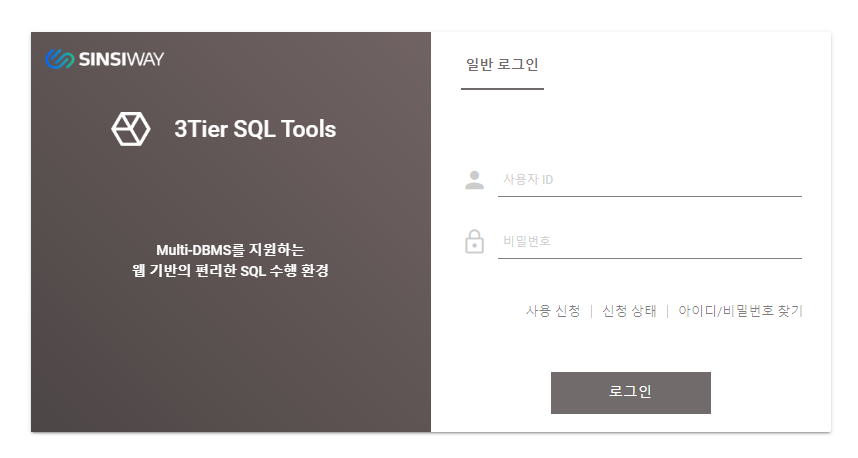

# Petra Data Stuido\(3tier DBMS query tool\)의 장점.

* 제품 설치가 필요없습니다.

3 tier DBMS query tool인 Petra Data Studio는 WEB 서버로 운영되어 사용자 클라이언트에 어떤한 제품 설치도 불필요합니다.

여기에는 제품 설치 외에 데이터베이스 연결 라이브러리\(ODBCJ, JDBC, ADO 등\)도 해당됩니다.

* 보안 요소가 강화됩니다. 

기존 2 tier 제품군의 경우 모든 사용자 클라이언트에 설치 된 쿼리 툴로부터 접속되는 세션에 대한 통제를 위해 또 다른 보안 제품의 설치가 불가피했습니다.

하지만 3 tier WEB 기반 관리툴로 사용자 기반의 쉽고 강력한 권한제어가 가능해집니다.

